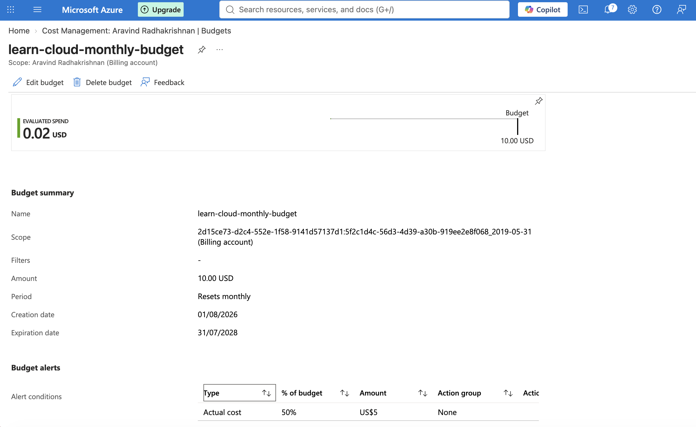
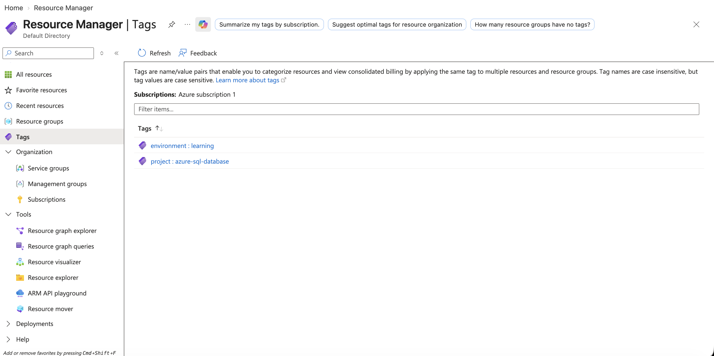

# Azure Cost Governance — Budgets & Tagging

## Overview
Set up proactive cost controls on an Azure subscription: a monthly budget with automated email alerts, and a resource tagging strategy to make future cost breakdowns meaningful. This project is about governance, not deployment — protecting every other project from unexpected spend.

## What I Built
- A monthly budget ($10 USD) scoped to the full subscription, with an email alert triggered at 50% of spend
- A consistent tagging pattern (`project`, `environment`) applied to existing resources, to enable cost breakdown by project going forward

## Why This Matters
Cost governance is a real, ongoing responsibility in cloud roles — unmanaged spend is one of the most common ways companies lose money in the cloud. Tags are what make a bill actually explainable: without them, a cost report just says "you spent $X" with no way to trace which project or environment caused it.

## Budget Configuration

- **Name:** `learn-cloud-monthly-budget`
- **Amount:** $10.00 USD/month
- **Reset period:** Monthly
- **Alert threshold:** 50% of budget ($5) → email notification

## Tagging Strategy

Applied two tags to the Azure SQL Server resource:
- `project: azure-sql-database`
- `environment: learning`

This pattern is designed to be repeated across every future resource, so Cost Management can eventually break down spend by project rather than showing one lump sum.

## Troubleshooting Highlights

**1. Budget appeared "missing" after creation**

After creating the budget, it didn't show up in the Budgets list on a later visit.

**Root cause:** Azure budgets and resources exist at a specific *scope* (subscription, resource group, etc.). I was viewing the Budgets list scoped down to a single resource group (`learn-cloud-sql-rg`), while the budget itself was created at the full subscription level — so it was correctly filtered out, not actually missing.

**Fix:** Changed the scope back to the full subscription ("Aravind Radhakrishnan") in the Budgets view, and the budget appeared as expected.

**2. Tags didn't appear when grouping Cost Analysis by "Tag"**

Attempting to group the Cost Analysis chart by the `project` tag returned "No items found," despite the tags being correctly saved on the resource.

**Root cause:** per Microsoft's documentation, newly-applied resource tags take up to 24-48 hours to be indexed into Cost Management's filtering/grouping system — the tag itself is saved instantly, but the *cost reporting* pipeline lags behind.

**Fix:** No action needed — this resolves automatically once the indexing delay passes. This highlighted an important distinction between "the tag exists" and "the tag is queryable in cost reports."

## Skills Demonstrated
- Azure Cost Management: budgets, alert thresholds, scoping
- Resource tagging strategy and application
- Understanding of Azure's data propagation delays (a common source of false "bugs" for beginners)
- Troubleshooting based on Microsoft's official documentation

## Next Steps
- Apply the same tagging pattern to all resources across every project
- Add a second alert threshold (e.g., 80%, 100%) for tighter monitoring
- Explore Azure Policy to *enforce* tagging automatically on resource creation

---
**Tech stack:** Azure Cost Management, Azure Tags, Azure Policy (future)
**Author:** Aravind Radhakrishnan

